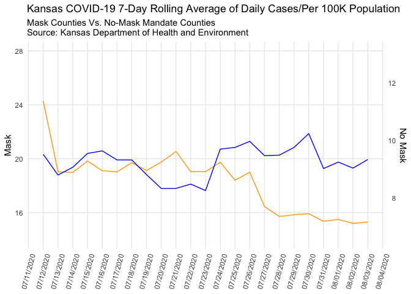

Lab 07 - Conveying the right message through visualisation
================
Anaelle Gackiere
02/27/2026

### Load packages and data

``` r
library(tidyverse) 
```

### Exercise 1

Explore its structure and use it to re-construct the misleading
visualization.

``` r
df <- read_csv("kansas_grouped_rolling_avg.csv")
```

    ## Rows: 46 Columns: 3
    ## ── Column specification ────────────────────────────────────────────────────────
    ## Delimiter: ","
    ## chr  (1): mask_mandate
    ## dbl  (1): rolling_avg
    ## date (1): date
    ## 
    ## ℹ Use `spec()` to retrieve the full column specification for this data.
    ## ℹ Specify the column types or set `show_col_types = FALSE` to quiet this message.

``` r
head(df)
```

    ## # A tibble: 6 × 3
    ##   date       rolling_avg mask_mandate
    ##   <date>           <dbl> <chr>       
    ## 1 2020-07-12        24.3 Mask        
    ## 2 2020-07-13        19.0 Mask        
    ## 3 2020-07-14        19.0 Mask        
    ## 4 2020-07-15        19.8 Mask        
    ## 5 2020-07-16        19.1 Mask        
    ## 6 2020-07-17        19.0 Mask

``` r
# separate the two groups first
masked <- df %>% filter(mask_mandate == "Mask")
unmasked <- df %>% filter(mask_mandate == "No Mask")


# scale factor to align the two different ranges. I played around with the scale factor to 
  # make the lines overlap like they did in the graph 

scale_factor <- max(masked$rolling_avg) / max(unmasked$rolling_avg) * 0.9

ggplot() +
  geom_line(data = masked, aes(x = date, y = rolling_avg), color = "orange") +
  geom_line(data = unmasked, aes(x = date, y = rolling_avg * scale_factor), color = "blue") +
  scale_y_continuous(
    name = "Mask",
    limits = c(14, 28),
    sec.axis = sec_axis(~ . / scale_factor, name = "No Mask", breaks = seq(4, 14, by = 2))
  ) +
  labs(
    title = "Kansas COVID-19 7-Day Rolling Average of Daily Cases/Per 100K Population",
    subtitle = "Mask Counties Vs. No-Mask Mandate Counties\nSource: Kansas Department of Health and Environment",
    x = NULL
  ) +
  scale_x_date(date_labels = "%m/%d/%Y", date_breaks = "1 day") +
  theme_minimal() +
  theme(
    axis.text.x = element_text(angle = 75, vjust = 0.5),
    panel.grid.minor = element_blank()
  )
```

<!-- --> …

### Exercise 2

Make a visualization that more accurately (and honestly) reflects the
data and conveys a clear message.

…

### Exercise 3

What message is more clear in your visualization than it was in the
original visualization?

### Exercise 4

What, if any, useful information do these data and your visualization
tell us about mask wearing and COVID? It’ll be difficult to set aside
what you already know about mask wearing, but you should try to focus
only on what this visualization tells. Feel free to also comment on
whether that lines up with what you know about mask wearing.

Using the same dataset you constructed, your goal now is to create a new
visualization that intentionally conveys the opposite message of your
previous, accurate visualization. This exercise is designed to highlight
the impact of visualization choices on the interpretation of data. It’s
a practical exploration of how changing the presentation can alter the
perceived message, underscoring the ethical implications of data
visualization.

…

### Exercise 5

Reflect on the message conveyed by your accurate visualization regarding
mask-wearing and COVID-19. Discuss the key factors that contribute to
this message, such as the variables used, the scale of the axes, and the
type of visualization.

### Exercise 6

Plan Your Opposite Visualization: Briefly determine what opposite
message you want to covey. Consider the data you have available (or
could easily add).

### Exercise 7

Use visualization techniques to craft a chart or graph that conveys this
contrary perspective. Pay careful attention to how different
visualization choices, like altering the y-axis scale or changing the
chart type, can influence the message received by the audience.
