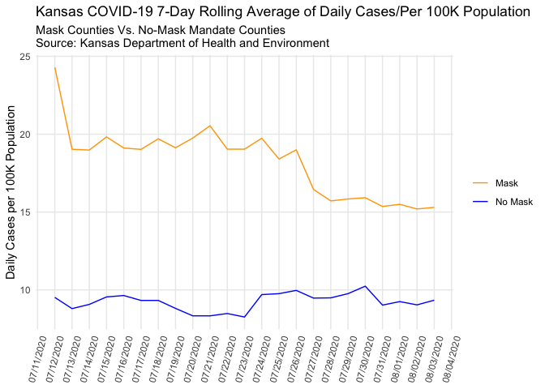
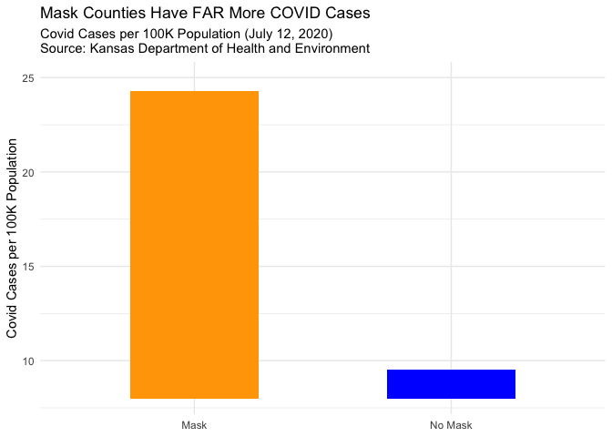
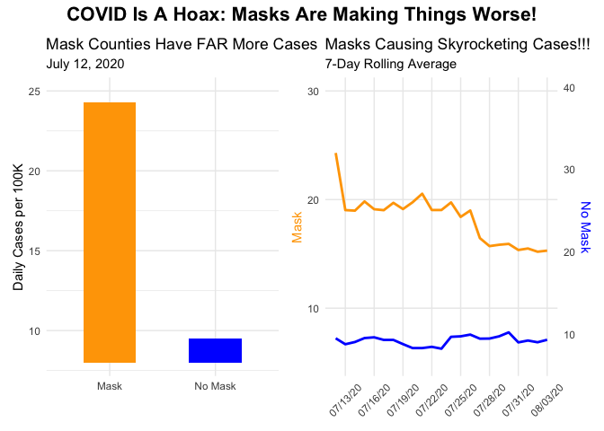

Lab 07 - Conveying the right message through visualisation
================
Anaelle Gackiere
02/27/2026

### Load packages and data

``` r
library(tidyverse) 
```

### Exercise 1

Explore its structure and use it to re-construct the misleading
visualization.

``` r
df <- read_csv("kansas_grouped_rolling_avg.csv")
```

    ## Rows: 46 Columns: 3
    ## ── Column specification ────────────────────────────────────────────────────────
    ## Delimiter: ","
    ## chr  (1): mask_mandate
    ## dbl  (1): rolling_avg
    ## date (1): date
    ## 
    ## ℹ Use `spec()` to retrieve the full column specification for this data.
    ## ℹ Specify the column types or set `show_col_types = FALSE` to quiet this message.

``` r
head(df)
```

    ## # A tibble: 6 × 3
    ##   date       rolling_avg mask_mandate
    ##   <date>           <dbl> <chr>       
    ## 1 2020-07-12        24.3 Mask        
    ## 2 2020-07-13        19.0 Mask        
    ## 3 2020-07-14        19.0 Mask        
    ## 4 2020-07-15        19.8 Mask        
    ## 5 2020-07-16        19.1 Mask        
    ## 6 2020-07-17        19.0 Mask

``` r
# separate the two groups first
masked <- df %>% filter(mask_mandate == "Mask")
unmasked <- df %>% filter(mask_mandate == "No Mask")


# scale factor to align the two different ranges. I played around with the scale factor to 
  # make the lines overlap like they did in the graph 

scale_factor <- max(masked$rolling_avg) / max(unmasked$rolling_avg) * 0.9

ggplot() +
  geom_line(data = masked, aes(x = date, y = rolling_avg), color = "orange") +
  geom_line(data = unmasked, aes(x = date, y = rolling_avg * scale_factor), color = "blue") +
  scale_y_continuous(
    name = "Mask",
    limits = c(14, 28),
    sec.axis = sec_axis(~ . / scale_factor, name = "No Mask", breaks = seq(4, 14, by = 2))
  ) +
  labs(
    title = "Kansas COVID-19 7-Day Rolling Average of Daily Cases/Per 100K Population",
    subtitle = "Mask Counties Vs. No-Mask Mandate Counties\nSource: Kansas Department of Health and Environment",
    x = NULL
  ) +
  scale_x_date(date_labels = "%m/%d/%Y", date_breaks = "1 day") +
  theme_minimal() +
  theme(
    axis.text.x = element_text(angle = 75, vjust = 0.5),
    panel.grid.minor = element_blank()
  )
```

<!-- --> …

### Exercise 2

Make a visualization that more accurately (and honestly) reflects the
data and conveys a clear message.

``` r
ggplot() +
  geom_line(data = masked, aes(x = date, y = rolling_avg, color = "Mask")) +
  geom_line(data = unmasked, aes(x = date, y = rolling_avg, color = "No Mask")) +
  scale_color_manual(values = c("Mask" = "orange", "No Mask" = "blue")) +
  labs(
    title = "Kansas COVID-19 7-Day Rolling Average of Daily Cases/Per 100K Population",
    subtitle = "Mask Counties Vs. No-Mask Mandate Counties\nSource: Kansas Department of Health and Environment",
    x = NULL,
    y = "Daily Cases per 100K Population",
    color = NULL
  ) +
  scale_x_date(date_labels = "%m/%d/%Y", date_breaks = "1 day") +
  theme_minimal() +
  theme(
    axis.text.x = element_text(angle = 75, vjust = 0.5),
    panel.grid.minor = element_blank(),
    legend.position = "right"
  )
```

<!-- -->

…

### Exercise 3

In my visualization, it is easier to compare the daily cases of covid
for no mask mandate counties vs. mask mandate counties.

### Exercise 4

These data and my visualization suggests that mask wearing helps prevent
covid. However, I admit that this is a causal claim; the visual
communicates that there are fewer COVID cases for mask mandate counties
compared to those who did not have mask mandates.

### Exercise 5

Reflect on the message conveyed by your accurate visualization regarding
mask-wearing and COVID-19. Discuss the key factors that contribute to
this message, such as the variables used, the scale of the axes, and the
type of visualization.

The key factors that contributed to my message described above
included: 1. Using a singly y-axis so that both mask and no mask
counties could be compared appropriately 2. The line graph works in this
case because this is time series data. It helps show the trends over
time for both groups. 3. For the variables, I still used No Mask and
Mask, but I did not treat them differently when plotting (as compared to
the first visualization).

### Exercise 6

For my opposite visualization, I want to show that counties with mask
mandates have far more COVID cases than no mask mandates. In this
scenario, COVID is a hoax, and only a few people in the no mask mandate
counties have COVID because they are outliers.

### Exercise 7

I’m thinking of using a bar chart to demonstrate my message.

``` r
# first I want to find a day where there's a big gap between Mask and No Mask cases.
df %>%
  pivot_wider(names_from = mask_mandate, values_from = rolling_avg) %>%
  mutate(gap = Mask - `No Mask`) %>%
  arrange(desc(gap))
```

    ## # A tibble: 23 × 4
    ##    date        Mask `No Mask`   gap
    ##    <date>     <dbl>     <dbl> <dbl>
    ##  1 2020-07-12  24.3      9.52  14.8
    ##  2 2020-07-21  20.5      8.34  12.2
    ##  3 2020-07-20  19.8      8.34  11.4
    ##  4 2020-07-23  19.0      8.26  10.8
    ##  5 2020-07-22  19.0      8.49  10.6
    ##  6 2020-07-18  19.7      9.33  10.4
    ##  7 2020-07-19  19.1      8.82  10.3
    ##  8 2020-07-15  19.8      9.55  10.3
    ##  9 2020-07-13  19.0      8.80  10.2
    ## 10 2020-07-24  19.7      9.70  10.0
    ## # ℹ 13 more rows

``` r
# now I'm plotting this day as a bar chart for my "propaganda piece"
covid_hoax <- df %>% filter(date == as.Date("2020-07-12"))

ggplot(covid_hoax, aes(x = mask_mandate, y = rolling_avg, fill = mask_mandate)) +
  geom_bar(stat = "identity", width = 0.5) +
  scale_fill_manual(values = c("Mask" = "orange", "No Mask" = "blue")) +
  scale_y_continuous(limits = c(8, 25), oob = scales::squish) +
  labs(
    title = "Mask Counties Have FAR More COVID Cases",
    subtitle = "Covid Cases per 100K Population (July 12, 2020)\nSource: Kansas Department of Health and Environment",
    x = NULL,
    y = "Covid Cases per 100K Population",
    fill = NULL
  ) +
  theme_minimal() +
  theme(legend.position = "none")
```

<!-- -->

That’s a bit boring though, so I decided to try out the patchwork
library and create a better propaganda piece.

``` r
library(patchwork)

# bar chart for the one day
p1 <- ggplot(covid_hoax, aes(x = mask_mandate, y = rolling_avg, fill = mask_mandate)) +
  geom_bar(stat = "identity", width = 0.5) +
  scale_fill_manual(values = c("Mask" = "orange", "No Mask" = "blue")) +
  scale_y_continuous(limits = c(8, 25), oob = scales::squish) +
  labs(
    title = "Mask Counties Have FAR More Cases",
    subtitle = "July 12, 2020",
    x = NULL,
    y = "Daily Cases per 100K",
    fill = NULL
  ) +
  theme_minimal() +
  theme(legend.position = "none")

# bad line graph for rolling average

scale_factor2 <- max(unmasked$rolling_avg) / max(masked$rolling_avg) * 1.8 # this is for the axes

p2 <- ggplot() +
  geom_line(data = masked, aes(x = date, y = rolling_avg), color = "orange", linewidth = 1) +
  geom_line(data = unmasked, aes(x = date, y = rolling_avg * scale_factor2), color = "blue", linewidth = 1) +
  scale_y_continuous(
    name = "Mask",
    sec.axis = sec_axis(~ . / scale_factor2, name = "No Mask") # note to self - this is the  y axis on the right
  ) +
  coord_cartesian(ylim = c(5, 30)) + # this helps manipulate the look
  labs(
    title = "Masks Causing Skyrocketing Cases!!!",
    subtitle = "7-Day Rolling Average",
    x = NULL
  ) +
  scale_x_date(date_labels = "%m/%d/%y", date_breaks = "3 days") +
  theme_minimal() +
  theme(
    axis.title.y.left = element_text(color = "orange"),
    axis.title.y.right = element_text(color = "blue"),
    axis.text.x = element_text(angle = 45, vjust = 0.5),
    panel.grid.minor = element_blank()
  )

p1 + p2 + plot_annotation(
  title = "COVID Is A Hoax: Masks Are Making Things Worse!",
  theme = theme(plot.title = element_text(size = 16, hjust = 0.5, face = "bold"))
)
```

<!-- -->
